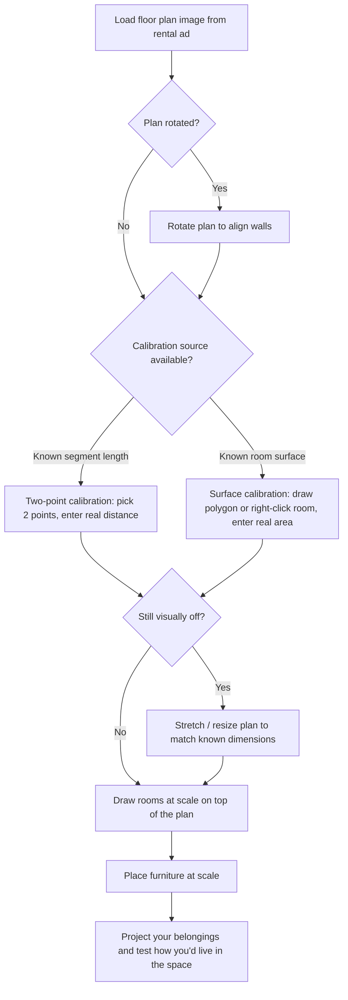

# Sqale

<p align="center">
  
</p>

[Demo](https://tucsky.github.io/sqale/)

## Intro

Sqale is a client-side floor plan editor for turning rough rental-ad floor plan images into something you can actually reason with.

Its goal is simple: take a pixelated, badly scaled, or rotated floor plan picture, calibrate it, and project your own belongings inside it so you can visualize yourself living in the space.

The app runs without a backend: all project data is stored locally in IndexedDB.

## Features

- Plan image upload (`PNG` / `JPG`) and direct transform editing on canvas.
- Scale calibration from either:
  - two picked points + known real-world distance,
  - or a drawn/selected room surface + known real-world area value.
- Room polygon drafting with live closure state and area calculation.
- Independent length and surface unit display/input (`m`, `cm`, `ft`, `in`) from Settings.
- Furniture insertion, transform editing, color editing, and layer-level operations.
- Layer panel with contextual actions: show/hide, lock/unlock, reorder, rename, delete.
- Clipboard support for furniture copy/paste and image paste-to-plan workflows.
- Grid rendering with spacing presets and optional snap-to-grid.
- Multi-floor management (create/select/rename/delete) with persistent local storage.

## Stack

- Vue 3 + TypeScript (strict)
- Vite
- Tailwind CSS + shadcn-vue (Radix Vue primitives)
- Fabric.js
- idb (IndexedDB wrapper)
- Vitest

## Installation

```bash
npm install
npm run dev
```

Optional verification:

```bash
npm run typecheck
npm test
npm run build
```

## Deployment (GitHub Pages)

This repository includes `.github/workflows/deploy-pages.yml` to publish the app to GitHub Pages on every push to `main`.

One-time GitHub setup:

1. Open repository `Settings` -> `Pages`.
2. In `Build and deployment`, set `Source` to `GitHub Actions`.
3. Push to `main` (or run the workflow manually from `Actions`).

The workflow builds with a Pages-compatible base path (`/<repo-name>/`) and deploys the generated `dist/` artifact.

## How It Works



### Folder Conventions

- `src/components/ui/*`: framework-level reusable UI primitives only.
- `src/features/*`: product-level behavior grouped by feature.
- `src/storage/*`: persistence boundary (IndexedDB).
- `src/types/*`: shared domain types.
